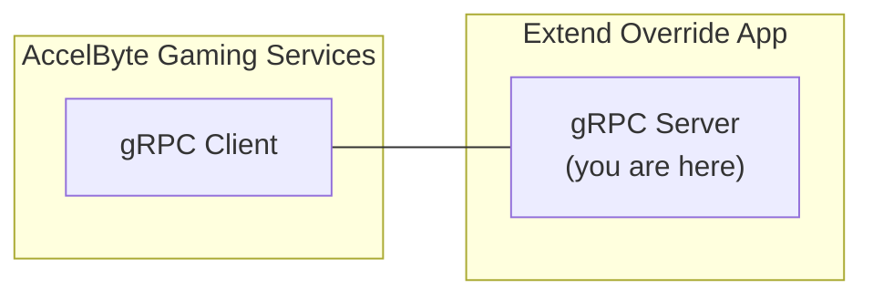

# matchmaking-function-grpc-plugin-server-go



`AccelByte Gaming Services` (AGS) features can be customized by using Extend Override apps. An Extend Override app is essentially a gRPC server, which contains one or more custom functions. which can be called by AGS instead of the default functions.

## Overview

This repository contains a sample `Extend Override` app for `matchmaking function` written in `Go`. It shows how a custom matchmaking logic, which matches two players may be implemented.

This sample app also shows the instrumentation setup necessary for observability. It is required so that metrics, traces, and logs can flow properly when the app is deployed.

## Prerequisites

1. Windows 10 WSL2 or Linux Ubuntu 20.04 with the following tools installed.

   a. bash

   b. make

   c. Docker v23.x

   d. Go 1.18

   e. Git

   f. [Postman](https://www.postman.com/)

2. Access to AGS environment.

   a. Base URL:
   
      - For `Starter` tier e.g.  https://spaceshooter.dev.gamingservices.accelbyte.io
      - For `Premium` tier e.g.  https://dev.accelbyte.io
      
   b. A game namespace. If you don't have one yet, [create a game namespace](https://docs.accelbyte.io/gaming-services/getting-started/how-to/create-a-game-namespace/). Keep the `Namespace ID`.

   c. [Create an OAuth Client](https://docs.accelbyte.io/gaming-services/services/access/authorization/manage-access-control-for-applications/#create-an-iam-client) with confidential client type. Keep the `Client ID` and `Client Secret`.

## Set up the sample app

1. Create a Docker compose `.env` file by copying the content of [.env.template](.env.template) file.

   > :warning: **The host OS environment variables have higher precedence compared to `.env` file variables**: If the variables in `.env` file do not seem to take effect properly, check if there are host OS environment variables with the same name. See Docker's documentation about [Docker compose environment variables precedence](https://docs.docker.com/compose/environment-variables/envvars-precedence/).

2. Fill in the required environment variables in the `.env` file as follows.

   ```
   AB_BASE_URL=https://demo.accelbyte.io     # Base URL of AGS environment
   AB_CLIENT_ID='xxxxxxxxxx'                 # Client ID from the Prerequisites section
   AB_CLIENT_SECRET='xxxxxxxxxx'             # Client Secret from the Prerequisites section
   AB_NAMESPACE='xxxxxxxxxx'                 # Namespace ID from the Prerequisites section
   PLUGIN_GRPC_SERVER_AUTH_ENABLED=false     # Enable or disable access token and permission verification
   ```

   > :warning: **Keep PLUGIN_GRPC_SERVER_AUTH_ENABLED=false for now**. It is not currently supported by AGS, but it will be enabled later on to improve security. If it is enabled, the gRPC server will reject any calls from gRPC clients without proper authorization metadata.

## Build the sample app

To build the sample app, use the following command:

```
make build
```

## Run the sample app

To build and run this sample app in a container, use the following command:

```
docker compose up --build
```

## Test the sample app

You can test the sample app in a local development environment and with AGS.

### Test in a local development environment

The custom functions in this sample app can be tested locally using [Postman](https://www.postman.com/).

1. Run this gRPC server sample app by using the following command.

   ```shell
   docker compose up --build
   ```

2. In Postman, create a new gRPC request, then type in `localhost:6565` as the server URL. See Postman's tutorial [here](https://blog.postman.com/postman-now-supports-grpc/).

   > :warning: **If you are running [grpc-plugin-dependencies](https://github.com/AccelByte/grpc-plugin-dependencies) stack alongside this sample app as mentioned in [Test Observability](#test-observability)**: Enter `localhost:10000` instead of `localhost:6565`. This way, the `gRPC server` will be called via `Envoy` service within `grpc-plugin-dependencies` stack instead of directly.

3. Continue by selecting the `MakeMatches` gRPC stream method and click the **Invoke** button. This will start a stream connection to the gRPC server sample app.

4. Proceed by first sending parameters to specify the number of players in a match. Copy the sample `json` below. Then, click **Send**.

   ```json
   {
       "parameters": {
           "rules": {
               "json": "{\"shipCountMin\":2, \"shipCountMax\":2}"
           }
       }
   }
   ```

5. Now, send the match ticket to start matchmaking. Copy the sample `json` below and replace it into the Postman message. Then, click **Send**. Repeat this step until the number of players is met and a match can be created. In this case, it is two players.

   ```json
   {
       "ticket": {
           "players": [
               {
                   "player_id": "playerA"
               }
           ]
       }
   }
   ```

6. If successful, you will receive responses (downstream) in Postman, similar to the following:

   ```json
   {
       "match": {
           "tickets": [],
           "teams": [
               {
                   "user_ids": [
                       "playerA",
                       "playerB"
                   ]
               }
           ],
           "region_preferences": [
               "any"
           ],
           "match_attributes": null
       }
   }
   ```

### Test with AGS

To test the sample app, which runs locally with AGS, the `gRPC server` needs to be connected to the internet. To do this without requiring public IP, you can use [ngrok](https://ngrok.com/).

1. Run this `gRPC server` sample app by using the following command:

   ```shell
   docker compose up --build
   ```

2. Sign in or sign up to [ngrok](https://ngrok.com/) and get your authtoken from the ngrok dashboard.

3. In this sample app root directory, run the following helper command to expose the gRPC server port in the local development environment to the internet. Take note of the `ngrok` forwarding URL (e.g., `http://0.tcp.ap.ngrok.io:xxxxx`).

   ```
   make ngrok NGROK_AUTHTOKEN=xxxxxxxxxxx
   ```

   > :warning: **If you are running [grpc-plugin-dependencies](https://github.com/AccelByte/grpc-plugin-dependencies) stack alongside this sample app as mentioned in the [Test observability](#test-observability) section**: Run the above command in `grpc-plugin-dependencies` directory instead of this sample app directory. This way, the `gRPC server` will be called via `Envoy` service within the `grpc-plugin-dependencies` stack instead of directly.

4. [Create an OAuth Client](https://docs.accelbyte.io/guides/access/iam-client.html) with `confidential` client type. Keep the `Client ID` and `Client Secret`.

   - NAMESPACE:{namespace}:MATCHMAKING:RULES [CREATE, READ, UPDATE, DELETE]
   - NAMESPACE:{namespace}:MATCHMAKING:FUNCTIONS [CREATE, READ, UPDATE, DELETE]
   - NAMESPACE:{namespace}:MATCHMAKING:POOL [CREATE, READ, UPDATE, DELETE]
   - NAMESPACE:{namespace}:MATCHMAKING:TICKET [CREATE, READ, UPDATE, DELETE]
   - ADMIN:NAMESPACE:{namespace}:INFORMATION:USER:* [CREATE, READ, UPDATE, DELETE]
   - ADMIN:NAMESPACE:{namespace}:SESSION:CONFIGURATION:* [CREATE, READ, UPDATE, DELETE]

   > :warning: **Oauth Client created in this step is different from the one from Prerequisites section:** It is required by [demo.sh](demo.sh) script in the next step to register the `gRPC Server` URL and also to create and delete test users.

5. Run the [demo.sh](demo.sh) script to simulate the matchmaking flow which calls this sample app `gRPC server` using the `Client ID` and `Client Secret` created in the previous step. Pay attention to the sample `gRPC server` console log when the matchmaking flow is running. `gRPC Server` methods should get called when creating match tickets and it should group players in twos.

   ```
   export AB_BASE_URL='https://demo.accelbyte.io'
   export AB_CLIENT_ID='xxxxxxxxxx'         # Use the Client ID from the previous step
   export AB_CLIENT_SECRET='xxxxxxxxxx'     # Use the Client Secret from the previous step    
   export AB_NAMESPACE='accelbyte'          # Use your Namespace ID
   export GRPC_SERVER_URL='http://0.tcp.ap.ngrok.io:xxxxx'  # Use your ngrok forwarding URL
   bash demo.sh
   ```

   > :warning: **Make sure demo.sh has Unix line-endings (LF)**: If this repository was cloned in Windows for example, the `demo.sh` may have Windows line-endings (CRLF) instead. In this case, use tools like `dos2unix` to change the line-endings to Unix (LF). Invalid line-endings may cause errors such as `demo.sh: line 2: $'\r': command not found`.

> :warning: **Ngrok free plan has some limitations**: You may want to use paid plan if the traffic is high.

### Test observability

To see how the observability works in this sample app locally, set up the following:

1. Uncomment Loki logging driver in [docker-compose.yaml](docker-compose.yaml).

   ```
    # logging:
    #   driver: loki
    #   options:
    #     loki-url: http://host.docker.internal:3100/loki/api/v1/push
    #     mode: non-blocking
    #     max-buffer-size: 4m
    #     loki-retries: "3"
   ```

   > :warning: **Make sure to install docker loki plugin beforehand**: Otherwise, this sample app will not be able to run. This is required so that container logs can flow to the Loki service within the `grpc-plugin-dependencies` stack. Use this command to install the docker Loki plugin: `docker plugin install grafana/loki-docker-driver:latest --alias loki --grant-all-permissions`.

2. Clone and run the [grpc-plugin-dependencies](https://github.com/AccelByte/grpc-plugin-dependencies) stack alongside the sample app. After this, Grafana will be accessible at `http://localhost:3000`.

   ```
   git clone https://github.com/AccelByte/grpc-plugin-dependencies.git
   cd grpc-plugin-dependencies
   docker-compose up
   ```

   > :exclamation: Read more about [grpc-plugin-dependencies](https://github.com/AccelByte/grpc-plugin-dependencies) [here](https://github.com/AccelByte/grpc-plugin-dependencies/blob/main/README.md).

3. [Test in a local development environment](#test-in-a-local-development-environment) or [Test with AGS](#test-with-ags).

## Deploy the sample app

After testing, you can deploy the sample app to AGS. Follow these steps:

1. [Create a new Extend Override App in the AGS Admin Portal](https://docs.accelbyte.io/gaming-services/services/extend/override-ags-feature/getting-started-with-matchmaking-customization/#create-an-extend-app). Keep the repository URL.
2. Download and set up [extend-helper-cli](https://github.com/AccelByte/extend-helper-cli/) (only if this has not been set up previously).
3. Perform docker login using `extend-helper-cli` using the following command:
   ```
   extend-helper-cli dockerlogin --namespace my-game --app my-app --login
   ```
   > :exclamation: Read more about [extend-helper-cli](https://github.com/AccelByte/extend-helper-cli/) [here](https://github.com/AccelByte/extend-helper-cli/blob/master/README.md).
4. Build and push the sample app docker image to AccelByte ECR using the following command:
   ```
   make imagex_push REPO_URL=xxxxxxxxxx.dkr.ecr.us-west-2.amazonaws.com/accelbyte/justice/development/extend/xxxxxxxxxx/xxxxxxxxxx IMAGE_TAG=v0.0.1
   ```
   > :exclamation: **The REPO_URL is obtained from step 1**: It can be found under `Repository Url` in the app details.
